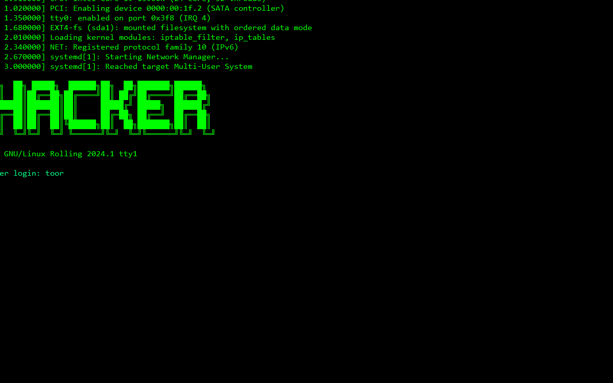

# 💻 HACKER EVOLUTION

> *"In a world where data is the new currency, only those who can read between the lines of code will survive."*

**Hacker Evolution** is a terminal-based hacking simulator, inspired by the classic *Hacker Evolution: Untold* (exosyphen studios). Explore a simulated network, scan servers, crack firewalls, steal data, and climb the leaderboard.



---

## 🎮 Story

You are **Ne0n**, a ghost hacker moving through the shadows of the network. After cracking the mainframe of *OmniCorp* — the megacorporation controlling 90% of the world's data — you've made a name for yourself in the underground. But OmniCorp doesn't forget. Every move you make could be your last.

With the help of **Cipher**, a rogue AI guiding you through encrypted channels, you explore secret servers, fortified databanks, and military mainframes. The more data you steal, the more powerful you become. But beware: every connection leaves traces.

> *"In cyberspace, no one can hear you type."*

---

## ✨ Features

| Feature | Description |
|---|---|
| **Hybrid Interface** | Cyberpunk terminal (Rich) + Visual Map (tkinter) |
| **Network Simulation** | Servers, firewalls, ports, real-time connections |
| **Hacking System** | Scan, crack, connect, download, upload, exec |
| **Economy** | Earn credits by selling data, buy upgrades |
| **Leaderboard** | Compete against NPC hackers |
| **Dynamic Story** | Unfolds episodically via the STORY command |
| **Hardware System** | RAM, CPU, personal firewall — upgrade your rig |

### Commands

| Command | Action |
|---|---|
| `HELP` | Show all available commands |
| `SCAN` | Scan local network for active servers |
| `SCANPORTS [IP]` | Scan a server's open ports |
| `CONNECT [IP]` | Connect to a remote server |
| `CRACK` | Crack the firewall of the connected server |
| `LS` | List files on the current server |
| `CAT [file]` | Read a file's contents |
| `DOWNLOAD [file]` | Download a file from the server |
| `UPLOAD [file]` | Upload a file to the server |
| `EXEC [file]` | Execute a file on the server |
| `SERVERS` | List all servers on the network |
| `CONFIG` | Show your system stats |
| `MONEY` | Show your credit balance |
| `STORY` | Reveal the plot episode by episode |
| `LOGOUT` | Disconnect from the current server |
| `TRANSFER [amount] [IP]` | Transfer credits to another hacker |
| `CLEAR` | Clear the terminal |

---

## 🚀 Installation

### Requirements

- **Python 3.10+**
- **tkinter** (included with Python on Windows/macOS; on Linux: `sudo apt install python3-tk`)

### Setup

```bash
# Clone the repository
git clone https://github.com/404funnotfound/hacker-evolution.git
cd hacker-evolution

# (Optional) Create a virtual environment
python -m venv .venv
source .venv/bin/activate  # Linux/macOS
.venv\Scripts\activate     # Windows

# Install dependencies
pip install -r requirements.txt

# Launch the game
python main.py
```

### Generate the GIF (optional)

To regenerate the demo GIF:

```bash
pip install pillow
python scripts/capture_gif.py
```

This will overwrite `assets/demo.gif`.

---

## 🧱 Project Structure

```
hacker-evolution/
├── main.py                 # Entry point
├── engine/
│   ├── game.py             # Game logic, state, network
│   └── config.py           # Configuration and colors
├── ui/
│   ├── app.py              # Main window and event loop
│   ├── commands.py         # Command implementations
│   ├── hud.py              # Animated heads-up display
│   ├── panels.py           # Side panels and map
│   └── rich_bridge.py      # Rich → tkinter Text widget bridge
├── scripts/
│   └── capture_gif.py      # Gameplay GIF capture script
├── assets/
│   ├── demo.gif            # Demo GIF
│   └── screenshot.png      # Static screenshot
├── data/                   # Game data (saves, configs)
└── requirements.txt        # Python dependencies
```

---

## 🛠 Tech Stack

- **Python** — Core language
- **tkinter** — GUI window, map, animated HUD
- **Rich** — Advanced terminal output (tables, panels, progress bars, colors)
- **PIL/Pillow** — GIF capture (ancillary script only)
- **Threading** — Async network operations

---

## 📜 License

MIT — feel free to fork, modify, and contribute.

---

<div align="center">
  Built with ☕ by <b>404 Fun Not Found</b><br>
  <sub>*Inspired by Hacker Evolution: Untold (exosyphen studios, 2007)*</sub>
</div>
